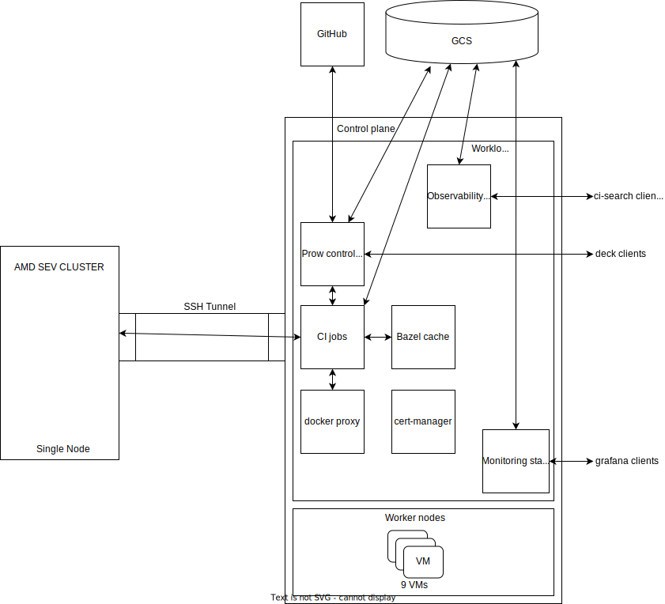

# AMD SEV Cluster
This is a single node cluster provided by AMD to help with the testing of KubeVirt and [SEV](https://developer.amd.com/sev/) (Secure Encrypted Virtualization). This cluster is treated as an external kubernetes provider for KubeVirt CI. KubeVirt is installed directly on the cluster and tests can be run against it. Nested virtualization is currently not supported with SEV and this is one of the reasons for treating this cluster as an external cluster provider. 

The prow control-plane cluster is used to run the prowjobs that cover the SEV testing. 

## Layout

As the cluster is only available remotely over SSH, an SSH tunnel is required to access the Kubernetes API which is listening on the private interface of the node. A tool such as [sshuttle](https://github.com/sshuttle/sshuttle) allows the prowjob pod on the Prow control-plane cluster to access the Kubernetes API of the AMD SEV cluster. The SSH key and kubeconfig are stored in the KubeVirt secrets repository.

## Automated SEV tests
A [periodic prowjob](https://github.com/kubevirt/project-infra/blob/main/github/ci/prow-deploy/files/jobs/kubevirt/kubevirt/kubevirt-periodics.yaml#L713) and an optional presubmit prowjob are available to carry out automated testing of SEV. These test lanes treat the AMD cluster as an external provider by setting `KUBEVIRT_PROVIDER="external"`.

## Hardware Details
- Two 64 Core AMD EPYC CPUs
- 1TB RAM
- 3TB Local NVME Storage

## Software Details
- RHEL 8.7
- Kernel 4.18.0-425.3.1.el8.x86_64
- cri-o v1.26.1
- Kubernetes v1.26.1
